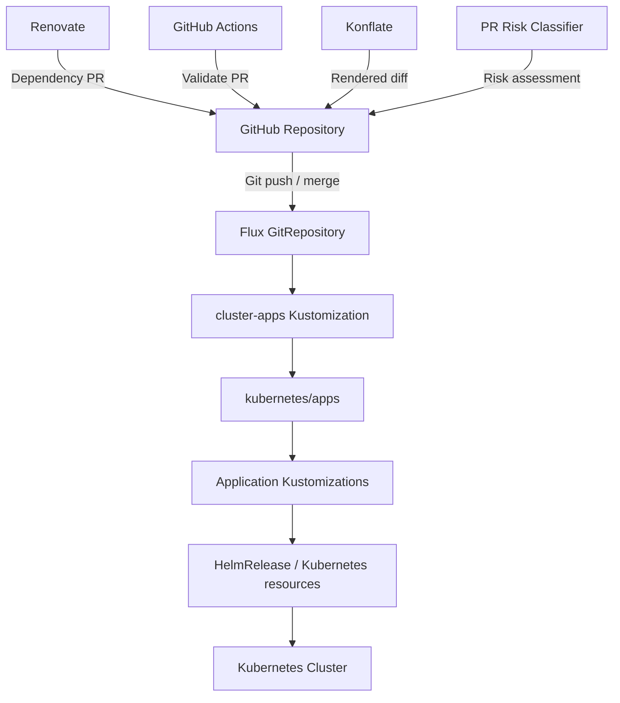

<div align="center">

# HOME LAB

_Declarative home infrastructure managed with Talos, Kubernetes, Flux, Ansible, and GitHub Actions_

[](https://www.talos.dev/)
[](https://kubernetes.io/)
[](https://fluxcd.io/)
[](https://github.com/qnimbus/home-lab/actions/workflows/renovate.yaml)
[](https://github.com/qnimbus/home-lab/actions/workflows/validate.yaml)


</div>

---

<details>
<summary><strong>Table of Contents</strong> (click to expand)</summary>

1. [Overview](#-overview)
2. [Kubernetes](#-kubernetes)

   - [Core Components](#core-components)
   - [GitOps](#gitops)
   - [Flux Workflow](#flux-workflow)
   - [Folder Structure](#folder-structure)

3. [TrueNAS / Docker](#-truenas--docker)
4. [Secrets](#-secrets)
5. [Automation and Validation](#-automation-and-validation)
6. [Hardware](#-hardware)

   - [Kubernetes](#kubernetes)
   - [NAS](#nas)
   - [Networking](#networking)

7. [Getting Started](#-getting-started)
8. [Future Plans](#-future-plans)
9. [Gratitude and Thanks](#-gratitude-and-thanks)
10. [License](#-license)

</details>

---

## 💡 Overview

This repository contains the declarative configuration for my home infrastructure. It is what happens when someone who only wanted to watch a film on the couch discovers GitOps.

It is intentionally a little over-engineered (for "a little", read "five nodes, a Ceph cluster and a risk classifier"): the goal is not merely to run a few services, but to make the infrastructure **repeatable, reviewable, recoverable, and largely self-managing** — so that when I break it, I can at least break it the same way twice.

The repository currently manages two complementary platforms:

- a **bare-metal Talos Linux Kubernetes cluster**, managed through Flux GitOps;
- a **TrueNAS host running Docker Compose workloads**, deployed through `doco-cd` and Ansible.

The repository also contains the tooling required to bootstrap and operate both environments, including:

- [Talos Linux](https://www.talos.dev/) for the Kubernetes nodes;
- [Kubernetes](https://kubernetes.io/) for container orchestration;
- [Flux](https://fluxcd.io/) for GitOps reconciliation;
- [Cilium](https://cilium.io/) for cluster networking;
- [Rook](https://rook.io/) / [Ceph](https://ceph.io/) for distributed Kubernetes storage;
- [External Secrets Operator](https://external-secrets.io/) and [1Password](https://1password.com/) for application secrets;
- [Ansible](https://www.ansible.com/) for host-level provisioning;
- [doco-cd](https://github.com/kimdre/doco-cd) for Docker Compose GitOps;
- [Renovate](https://www.mend.io/renovate/) for dependency updates;
- [GitHub Actions](https://github.com/features/actions) for CI, validation and automation;
- [mise](https://mise.jdx.dev/) for reproducible tool versions;
- [just](https://just.systems/) as the operational command interface.

The guiding principle is simple:

> **If infrastructure or configuration matters, it belongs in Git.**

Manual intervention is sometimes necessary, but it should be the exception — and whenever practical, the resulting state should be captured back in the repository. "I'll remember what I changed" has a 100% failure rate around here.

---

## 🌱 Kubernetes

The primary compute platform is a bare-metal [Talos Linux](https://www.talos.dev/) Kubernetes cluster.

The current cluster consists of **five nodes**:

- 3 × control-plane nodes
- 2 × worker nodes

Yes, that is more nodes managing the cluster than doing the work. Any resemblance to a real organisation is purely coincidental.

The nodes use the `10.60.0.0/24` infrastructure network, with control-plane nodes at `.201`–`.203` and worker nodes at `.204`–`.205`.

Talos machine configuration is generated from composable Jinja2 templates and per-node configuration rather than maintaining large generated machine-config files in Git.

### Core Components

The Kubernetes platform includes:

- **Talos Linux** — immutable Linux distribution purpose-built for Kubernetes.
- **Kubernetes** — container orchestration platform.
- **Cilium** — eBPF-based cluster networking and kube-proxy replacement.
- **Flux** — GitOps reconciliation of cluster state.
- **cert-manager** — automated certificate management.
- **External Secrets Operator** — synchronizes secrets from external secret stores.
- **1Password** — source of application and infrastructure secrets.
- **Rook / Ceph** — distributed block storage for Kubernetes workloads.
- **Actions Runner Controller** — self-hosted GitHub Actions runners.
- **Konflate** — rendered Kubernetes diffing for pull requests.
- **Prometheus/Grafana and related observability components** — cluster and workload monitoring.
- **System and network components** — DNS, ingress/network services, upgrades and supporting infrastructure.

The application layer is organized by namespace under `kubernetes/apps/`.

Current application areas include:

```text
actions-runner-system
automation
cert-manager
database
default
downloads
external-secrets
flux-system
kube-system
mail
media
network
observability
rook-ceph
system
system-upgrade
```

### GitOps

[Flux](https://fluxcd.io/) is the source of truth for the Kubernetes cluster.

The repository's cluster entry point is:

```text
kubernetes/
└── clusters/
    └── main/
        ├── kustomization.yaml
        └── apps.yaml
```

`apps.yaml` defines the top-level `cluster-apps` Flux `Kustomization`, which points at:

```text
./kubernetes/apps
```

Flux recursively discovers the application Kustomizations beneath this tree.

Rather than repeating cluster-wide policy in every application, `cluster-apps` also applies common configuration to the resources it manages. This includes:

- post-build variable substitution;
- consistent Kustomization retry and timeout behaviour;
- HelmRelease remediation strategies;
- Helm CRD installation/upgrade policy;
- Helm drift detection;
- selected PostgreSQL bootstrap conventions.

This keeps individual applications relatively small while making important operational policy explicit and centrally controlled.

### Flux Workflow

At a high level, changes flow through the system like this:



A normal application change therefore follows:

1. Configuration is changed in Git.
2. GitHub Actions validates the change.
3. Renovate may propose dependency updates automatically.
4. Konflate can render the resulting Kubernetes changes.
5. The PR risk classifier evaluates the change and its evidence.
6. The change is reviewed and merged.
7. Flux detects the new Git revision.
8. Flux reconciles the desired state into the cluster.

There is deliberately no requirement for a developer to manually run `kubectl apply` for normal application deployment. Flux would only put it back the way Git says anyway, and it never gets tired of being right.

### Folder Structure

The repository is a monorepo containing both cluster and host infrastructure:

```text
📁 /
├── 📁 .agents/             # Agent instructions and reusable task skills
├── 📁 .claude/             # Claude Code integration
├── 📁 .github/
│   ├── 📁 actions/          # Reusable GitHub Actions
│   ├── 📁 scripts/          # CI/automation scripts
│   └── 📁 workflows/        # GitHub Actions workflows
├── 📁 ansible/              # Host provisioning and configuration
├── 📁 bootstrap/            # End-to-end infrastructure bootstrap
├── 📁 docker/
│   └── 📁 nas/              # TrueNAS Docker Compose applications
├── 📁 kubernetes/
│   ├── 📁 apps/             # Flux-managed applications
│   ├── 📁 clusters/         # Cluster-level Flux configuration
│   ├── 📁 components/       # Reusable Kustomize components
│   └── 📁 talos/            # Declarative Talos machine configuration
├── 📄 AGENTS.md             # General agent/repository rules
├── 📄 CLAUDE.md             # Claude Code repository guidance
├── 📄 .mise/config.toml     # Pinned development/operations toolchain
└── 📄 .justfile             # Top-level operational command interface
```

---

## 🗄️ TrueNAS / Docker

Not everything needs Kubernetes. (That sentence took some time to write.)

The TrueNAS system runs a separate Docker Compose environment for workloads that are better suited to a conventional NAS/Compose deployment.

The Compose definitions live under:

```text
docker/nas/
```

Deployment is managed through [doco-cd](https://github.com/kimdre/doco-cd), while [Ansible](https://www.ansible.com/) handles host-level provisioning and lifecycle operations.

The resulting separation is intentional:

```text
                         home-lab
                            │
              ┌─────────────┴─────────────┐
              │                           │
       Kubernetes Cluster              TrueNAS
              │                           │
          Talos Linux                Docker Engine
              │                           │
             Flux                    doco-cd
              │                           │
       kubernetes/apps/              docker/nas/
```

This allows Kubernetes to remain the platform for distributed/container-orchestration workloads while keeping NAS-oriented services close to the storage they consume.

Bootstrap operations for the NAS are available through:

```sh
just bootstrap nas
```

---

## 🔐 Secrets

Secrets are deliberately split according to their purpose.

### Talos / infrastructure secrets

Talos cluster secrets are **not stored in Git**, encrypted or otherwise. The repository is public; my certificate authorities would rather not be.

The Talos templates contain `op://` references which are resolved through the [1Password CLI](https://developer.1password.com/docs/cli/) at render time.

The primary Talos secret material is stored in the `homelab` 1Password vault.

This includes the cluster and machine certificate authorities, bootstrap tokens, service-account signing material and other Talos/Kubernetes bootstrap secrets.

For example:

```text
op://homelab/talos/MACHINE_CA_CRT
op://homelab/talos/MACHINE_CA_KEY
op://homelab/talos/CLUSTER_CA_CRT
...
```

### Application secrets

Application credentials are managed through **External Secrets Operator**, with 1Password acting as the external secret store.

This keeps application credentials out of Kubernetes manifests and out of Git while allowing Flux to reconcile the resulting Kubernetes Secrets.

### Local credentials

Files such as:

```text
kubeconfig
talosconfig
age.key
```

are local operational credentials and are intentionally excluded from version control.

---

## 🤖 Automation and Validation

Automation is treated as part of the infrastructure rather than an afterthought.

### Toolchain

Tool versions are pinned through [`mise`](https://mise.jdx.dev/) in:

```text
.mise/config.toml
```

This provides reproducible versions of the tools used to operate and validate the repository, including:

- `kubectl`
- `kustomize`
- `helm`
- `helmfile`
- `flux`
- `talos`
- `sops`
- `age`
- `ansible`
- `just`
- `gh`
- `yq`
- `jq`
- `kubeconform`
- `yamllint`
- `yamlfmt`
- `shellcheck`
- `actionlint`
- `zizmor`
- `lefthook`
- `uv`

If that looks like a lot of tooling to keep a media server running: it is. `mise install` at least means nobody has to install it all by hand.

### just

[`just`](https://just.systems/) provides the operational interface to the repository.

Run:

```sh
just
```

to see the available command groups.

The main namespaces are:

```text
just bootstrap ...
just docker ...
just github ...
just k8s ...
just talos ...
```

Examples:

```sh
just k8s sync-hr <namespace> <name>
just k8s sync-ks <namespace> <name>
just k8s toolbox
just k8s debug-node <node>

just talos health
just talos nodes
just talos disks
just talos render-config <node>
just talos apply-node <node>
just talos upgrade-node <node>
just talos upgrade-k8s <version>

just bootstrap cluster
just bootstrap nas
```

### Pull Requests

Pull requests are validated before they reach the cluster.

GitHub Actions currently cover, among other things:

- Kubernetes manifest validation;
- Flux schema validation;
- Kustomize validation;
- PR-risk classifier tests;
- Renovate configuration validation;
- shell validation;
- GitHub Actions validation;
- GitHub Actions security analysis with `zizmor`.

Actions are pinned to immutable commit SHAs where practical.

### PR Risk

This repository also contains a purpose-built PR risk classifier. For a repository with exactly one human contributor, this is either admirable diligence or a cry for help.

The classifier combines:

- Git-level findings;
- rendered Konflate changes;
- TypeSafe Jev analysis;
- evidence collected for individual change surfaces;
- deterministic policy.

The important design principle is that the model is **advisory rather than authoritative**:

> Code determines the baseline risk; AI can raise the level, but it cannot make an unsafe change safe.

The classifier is deliberately fail-open with respect to infrastructure availability: if supporting analysis such as Konflate or Jev is unavailable, the result is marked unavailable/uncertain rather than silently treated as safe.

---

## ⚙️ Hardware

### Kubernetes

The Kubernetes cluster is currently a five-node bare-metal Talos deployment:

| Role          | Address       |
| ------------- | ------------- |
| Control plane | `10.60.0.201` |
| Control plane | `10.60.0.202` |
| Control plane | `10.60.0.203` |
| Worker        | `10.60.0.204` |
| Worker        | `10.60.0.205` |

The control-plane endpoint (`10.60.0.2`) is a Talos Layer-2 VIP, so the Kubernetes API stays reachable without Cilium. Cilium additionally advertises the same address to the gateway over eBGP, which spreads routed clients across the nodes.

The cluster uses:

- Talos Linux
- Cilium
- Rook/Ceph
- LACP bonded 2x10 GbE dedicated storage networking

### NAS

The primary NAS is a **Minisforum N5 Pro** running TrueNAS SCALE.

Current hardware includes:

- AMD Ryzen AI 9 HX PRO 370
- 64 GB DDR5 ECC memory
- 4 × 12 TB WD Red Plus HDDs
- mirrored NVMe metadata vdev
- LACP bonded 2x10 GbE dedicated storage networking

The NAS provides bulk storage as well as the host platform for Docker Compose workloads. The "AI" in the CPU name is, so far, mostly employed serving files.

### Networking

The home infrastructure uses a UniFi-based network with:

- UniFi Dream Machine Pro Max
- UniFi aggregation switching
- 2.5 GbE WAN uplink with fallback
- 10 GbE SFP+ infrastructure
- separate VLANs for LAN, guest, IoT, cameras and storage
- a dedicated storage network for cluster traffic

The Kubernetes nodes and NAS use high-speed connectivity for cluster and storage traffic while normal household traffic remains isolated through the UniFi VLAN topology. The rest of the household's interest in VLAN topology begins and ends with "is the Wi-Fi down?".

---

## 🚀 Getting Started

The recommended development environment is based on `mise`, with VS Code Dev Containers available for a more isolated setup.

### Prerequisites

Install:

- [mise](https://mise.jdx.dev/)
- [1Password CLI](https://developer.1password.com/docs/cli/)
- Docker, if using the Dev Container
- VS Code + Dev Containers extension, if using the Dev Container workflow

You also need access to the `homelab` 1Password vault.

### Install the toolchain

From the repository root:

```sh
mise trust
mise install
```

The repository's `.mise/config.toml` pins the required tool versions.

Then:

```sh
just
```

to verify that the operational command interface is available.

### Bootstrap

The bootstrap workflow is documented in [`bootstrap/README.md`](./bootstrap/README.md).

For a complete Kubernetes cluster bootstrap:

```sh
just bootstrap cluster
```

For the TrueNAS/Docker environment:

```sh
just bootstrap nas
```

### Talos operations

Detailed Talos configuration and recovery information is documented in [`kubernetes/talos/README.md`](./kubernetes/talos/README.md).

Useful commands include:

```sh
just talos health
just talos nodes
just talos disks
just talos render-config <node>
```

---

## 🔮 Future Plans

This repository is deliberately evolutionary rather than static, which is a polite way of saying it is never finished. Infrastructure changes are generally introduced incrementally and captured as code before they become operational dependencies.

Areas of ongoing development include:

- further improving Kubernetes storage and Ceph resilience;
- expanding network automation and routing capabilities;
- improving observability and operational diagnostics;
- strengthening automated PR risk analysis;
- increasing the amount of infrastructure that can be safely recovered from a clean workstation;
- reducing remaining imperative operational procedures;
- continuing to improve the boundary between deterministic automation and AI-assisted operations.

The long-term goal is not to eliminate manual operations completely.

It is to make the **safe and repeatable path the easiest path** — ideally easy enough that I still take it at 23:00 on a Sunday.

---

## 🙏 Gratitude and Thanks

This repository is heavily influenced by the broader home-lab and Kubernetes community.

In particular, projects and repositories from the [home-operations](https://github.com/home-operations) community have been an important source of ideas around Flux, Kubernetes application structure, automation and repository conventions.

The [onedr0p/cluster-template](https://github.com/onedr0p/cluster-template) ecosystem and the many public Kubernetes-at-home repositories have also been valuable references.

A special thanks goes to everyone maintaining the open-source projects this infrastructure depends upon — Talos, Kubernetes, Flux, Cilium, Rook, Ceph, Renovate, Ansible, mise and the many Helm chart and Kubernetes projects underneath them.

And, naturally, thanks to [bykaj/home-ops](https://github.com/bykaj/home-ops) for providing the structural inspiration for this README — and for describing my bash scripts as "more engineered than a Swiss watch". I have chosen to take that as a compliment.

---

## 🔒 License

See [LICENSE](./LICENSE). **TL;DR**: if it breaks, you get to keep both pieces.
