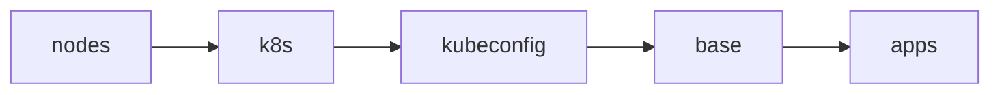

# Cluster

The entire process is driven by a single command:

```sh
just bootstrap cluster
```

Once it completes, Flux reconciles the rest of the repository and this
directory is not used again until the next rebuild.

## Stages

`just bootstrap cluster` runs these stages in order (see [mod.just](../mod.just)):



1. **nodes** - Renders each node's Talos config (`kubernetes/talos/*.j2` templates
   plus 1Password injection, `just talos render-config`) and applies it with
   `talosctl apply-config --insecure`. Nodes that are already configured are
   skipped, so the stage is idempotent.
2. **k8s** - Runs `talosctl bootstrap` against the controller, retrying until
   etcd reports the cluster already exists.
3. **kubeconfig** - Fetches the kubeconfig with `talosctl kubeconfig` and points
   it at the controller (the first `talosconfig` endpoint) for the rest of the run. The final stage
   re-fetches it so the endpoint returns to the Talos VIP.
4. **base** - Waits for every control plane apiserver to answer `/readyz`
   and for nodes to register (they stay `Ready=False` until the CNI is
   installed), then applies:
   - `kustomize/` - bootstrap Secrets rendered through `op inject`, plus
     their namespaces. These exist before their controllers so nothing
     deadlocks on a missing Secret:
     - `flux-system/sops-age` - decrypts `kubernetes/flux/vars/cluster-secrets.sops.yaml`.
     - `flux-system/flux-github-app` - GitRepository credentials for the
       private repo (later owned by flux-instance's `ExternalSecret`).
     - `external-secrets/onepassword-connect-secrets` - 1Password Connect
       credentials file and token (also read by the `onepassword` ClusterSecretStore).
   - `helmfile/crds.yaml` - CRDs extracted from upstream charts
     (envoy-gateway incl. Gateway API, grafana-operator, kube-prometheus-stack, snapshot-controller)
     and applied directly, so the first Flux reconcile doesn't fail dry-runs on
     `HTTPRoute`/`ServiceMonitor`/snapshot resources while their charts are
     still installing.
5. **apps** - `helmfile sync` of `helmfile/apps.yaml`, the minimal release
   chain Flux needs before it can take over:

   ```text
   cilium → coredns → spegel → cert-manager → external-secrets →
   onepassword-connect → flux-operator → flux-instance
   ```

   The cilium release also applies `kubernetes/apps/kube-system/cilium/config/`
   (IP pools, BGP, L2 announcements), and onepassword-connect applies the
   `onepassword` ClusterSecretStore. Once `flux-instance` is healthy, Flux
   reconciles `kubernetes/` and manages these same releases from then on.

> [!TIP]
> Every stage is safe to re-run. If bootstrap fails partway, fix the issue
> and run `just bootstrap cluster` again.

## Data restore

Bootstrap itself restores no application data. CNPG clusters built from
`kubernetes/components/postgres` recover from their Barman backups by default
once Flux applies them (a Kustomization labelled `components.postgres/cnpg=init`
starts empty instead). There is no volume-level restore: the old VolSync/restic
repositories on the NAS are the only PVC backups.

## Single source of truth

The helmfiles define no chart versions or values of their own. Each release's
chart and version are read from the app's own Flux manifests under
`kubernetes/apps/<namespace>/<name>/app/` (see [helmfile/templates/](./helmfile/templates/)):

- `ocirepository.yaml` when the HelmRelease uses `chartRef`, otherwise the
  HelmRelease's `chart.spec` plus the matching classic repo registered in
  [helmfile/default.yaml](./helmfile/default.yaml) (mirroring
  `kubernetes/flux/meta/repos/helm/`).
- Values from `helm/values.yaml` (the source of the `valuesFrom` ConfigMap),
  overlaid with any inline `spec.values`.

Bootstrap therefore installs exactly what Flux will later reconcile, and
Renovate updates only one place. Flux `${VAR}` substitution is not applied, so
bootstrap releases must not use it in their values.
